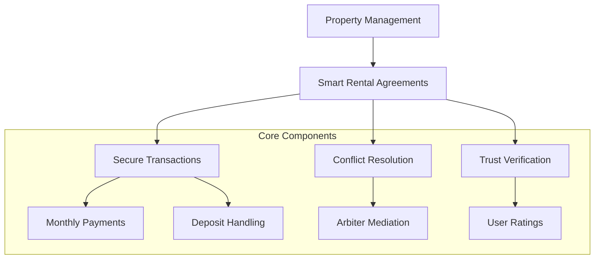

# Revolutionary Manager

A decentralized property management and rental marketplace built on the Stacks blockchain, empowering property owners and tenants with transparent, secure, and efficient interactions.

## Overview

Revolutionary Manager disrupts traditional property rental models by providing a trustless, blockchain-powered platform. Key features include:

- Seamless property listing and management
- Direct, secure rental agreements
- Automated payment processing
- Transparent dispute resolution
- Reputation-based trust system

## Architecture



## Key Components
1. Dynamic Property Listings
2. Smart Rental Agreements
3. Payment Infrastructure
4. Dispute Management
5. User Reputation System

## Getting Started

### Prerequisites
- Clarinet CLI
- Stacks wallet
- STX tokens

### Installation
```bash
git clone https://github.com/your-team/revolutionary-manager.git
cd revolutionary-manager
clarinet install
```

### Quick Example

1. **Create Property Listing**
```clarity
(contract-call? 
  .property-exchange 
  create-listing 
  "Urban Loft" 
  "Modern downtown space" 
  "Tech District" 
  u2500000 ;; Rent
  u5000000 ;; Deposit
  u3 ;; Min months
  u36 ;; Max months
  (list "gym" "workspace")
)
```

## Key Functions

### Property Management
- `create-listing`
- `update-listing`
- `change-listing-status`

### Rental Agreements
- `create-rental-agreement`
- `pay-rent`
- `complete-agreement`

### Dispute Resolution
- `file-dispute`
- `resolve-dispute`

## Development

### Testing
```bash
clarinet test
```

### Local Deployment
```bash
clarinet console
```

## Security

### Key Protections
- Blockchain-verified transactions
- Escrow-based deposit management
- Arbiter-mediated dispute resolution
- Reputation tracking

### Best Practices
- Verify all agreement terms
- Maintain wallet security
- Monitor transaction history
- Use reputation metrics

## Platform Economics
- Transparent fee structure
- Adjustable platform fees
- Maximum fee: 10%

## Contributing
Interested in improving Revolutionary Manager? Check our contribution guidelines.

## License
[Your License Here]